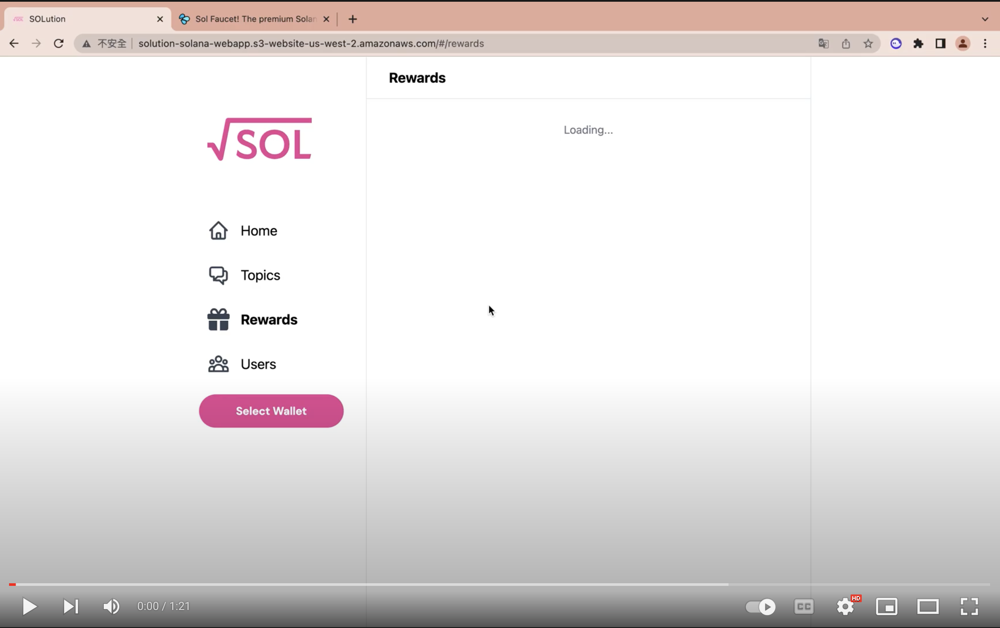

# SOLution

<p align="center">
  
</p>

## Concept

Our goal is to create a place for people to ask questions and get valuable answers incentivized by our novel business model of answer-to-earn. Since our main target is STEM students who strive to get the best quality of information from the Internet. Our app also supports Tex and Markdown syntaxes.

What you can do:

* Ask Questions: Pay for the base fee and reward for each question you asked. Base fee will be returned when an answer is selected and the reward will be given to the selected answer.
* Answer: You can submit the answer in the question's thread.

* Earn:
  * If you are the asker, you can select the best answer as the solution and **retrieve the base fee**.
  * If you are the answerer and your answer is selected as the solution, you can **earn the reward** from the asker. However, don't worry about your answer not being selected, you can delete your answer to get back the rent.

<p align="center">

</p>

### Demo Video

[](https://www.youtube.com/watch?v=eipn0sjSXEc)

## Play with the app

1. Install your wallet for Solana (Phantom or Solflare Supported).
2. Airdrop yourself from SOL using `solana-cli` or [Sol Faucet](solfaucet.com).
3. Enjoy the app! ([Demo Link](http://solution.dingbading.com)).

## Important: Before you start

Please follow the following best practice for all development on this project.

- Backend (Smart Contract): Should follow the test-driven approach. Write tests and make sure all the tests pass.
- Frontend: If you are unfamiliar with Vue, follow this [tutorial](https://vuejs.org/tutorial/#step-1). Note that the project is developed using **composition** and **SFC**.

## Project Structure

* **`app/`**: frontend Vuejs application
* **`programs/`**: Rust backend smart contract
* **`target/`**: target directory for deployment, generated after `anchor build`
  * **`target/deploy/so_lution-keypair.json`**: the private key that proves you own the contract
  * **`target/idl/so_lution.json`**: an interface description language file used to specify the interface between frontend and backend, like a schema
* **`tests/`**: tests that are run against the Rust backend
* **`Anchor.toml`**: the main configuration file for Anchor

## Resources

* [Private Developer Docs](https://hackmd.io/vNTooMzwQ_uJdSPPijLu0w)
* [Create a Solana Dapp from scratch](https://lorisleiva.com/create-a-solana-dapp-from-scratch)
* [Anchor Book](https://book.anchor-lang.com/introduction/introduction.html)
* [Solana Cookbook](https://solanacookbook.com/#contributing)
* [Anchor Related Documentation](https://github.com/project-serum/anchor)
* [Soldev Tutorials](https://soldev.app/library/tutorials)
* [Solana Official Docs](https://docs.solana.com)

## Environment

* Versions
  * `node 16.*.*`
  * `anchor-cli 0.24.2`
  * `solana-cli 1.9.25`
  * `rustc 1.61.0`

* Current Deployed ProgramID on Devnet: `AhTPm4QecF67HhvFnYVJkM9jrgMwJcJNC3ULTHnaxdkX`
  * check `target/deploy/so_lution-keypair.json`
* Authority of Deployed Program on Devnet: `Eyrm7NECYjcR2AZh1BfQ63mLoDBycwuFQRhiU4FrdQem`
* When you change the **programID**, make sure to check the following files and make sure that they or consistent (or you can just Ctrl + F search the entire directory)
  * `Anchor.toml`
  * Top of `programs/src/lib.rs`
  * Bottom of `target/idl/so_lution.json`

## Getting Started (Development Cycle)

### 1. Clone repository

### 2. [Create your Solana Wallet](https://docs.solana.com/wallet-guide)

```bash
# Generate new keypair
solana-keygen new
# Check your wallet address
solana address
# Check your wallet balance
solana balance
```

### 3. Develop locally

```bash
# Make sure you’re on the localnet.
solana config set --url localhost
# And check your Anchor.toml file. (check keypair path and network of use)

# Code…

# Run the tests. (builds, deploys, tests, and shuts off all at once)
anchor test

# -r resets the validator to genesis (or it will preload from test-ledger/)
solana-test-validator [-r]
anchor build
anchor deploy

# Run tests on the created local server to generate dummy data (Note that it will probably fail if your validator is not freshly created)
anchor run test

# Copy the new IDL to frontend.
anchor run copy-idl

# Serve your frontend application on localnet.
cd app && yarn run serve
```

### 4. Develop on Devnet (Possibly Mainnet in the future)

```bash
# Switch to the devnet cluster to deploy there.
solana config set --url devnet

# !! Update your Anchor.toml file !!

# Airdrop yourself some money if necessary. (Do this multiple times likely need 2 ~ 4 SOL)
solana airdrop 2

# Build and deploy to devnet.
anchor build
anchor deploy

# Copy the new IDL to frontend.
anchor run copy-idl

# Run frontend for devnet locally
cd app && yarn run serve:devnet
```

## License

SOLution is licensed under Apache 2.0.

Unless you explicitly state otherwise, any contribution intentionally submitted for inclusion in SOLution by you, as defined in the Apache-2.0 license, shall be licensed as above, without any additional terms or conditions.
